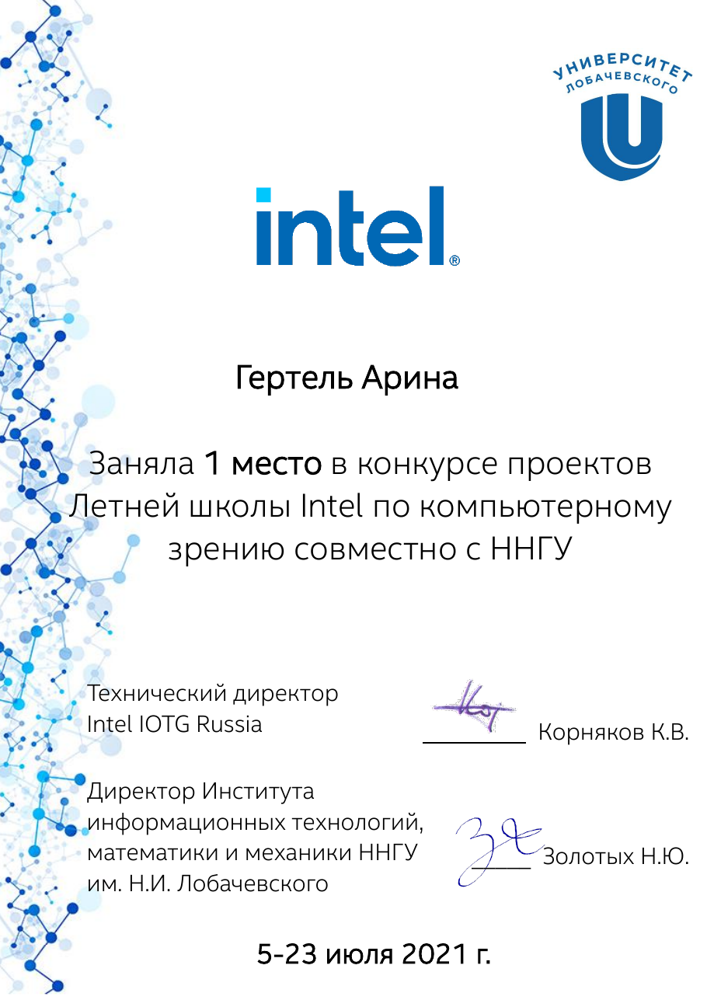
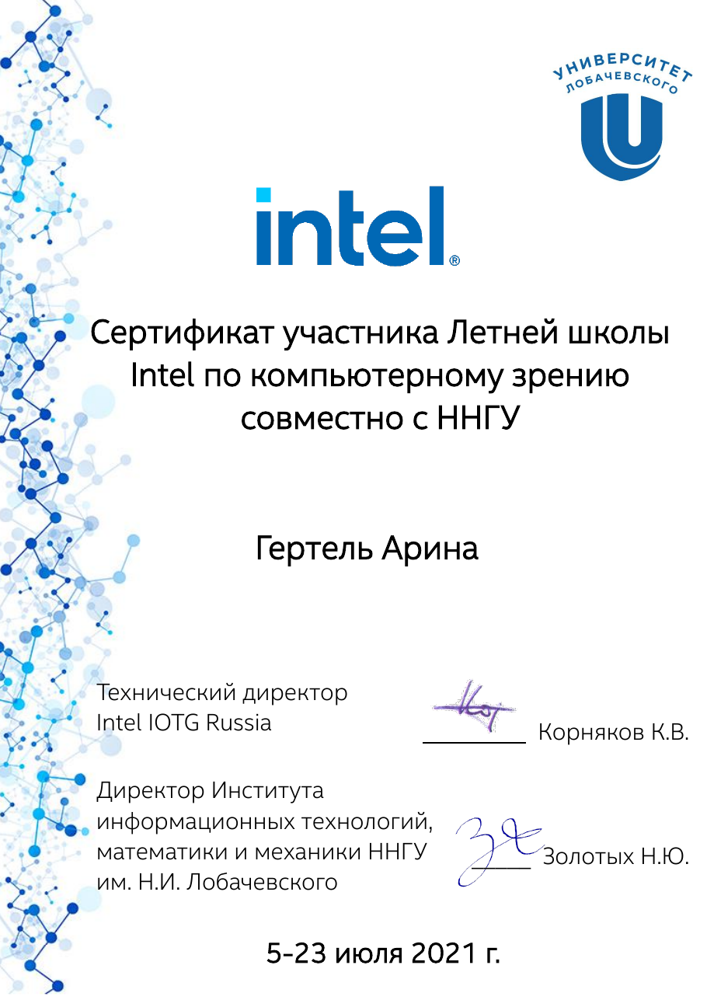
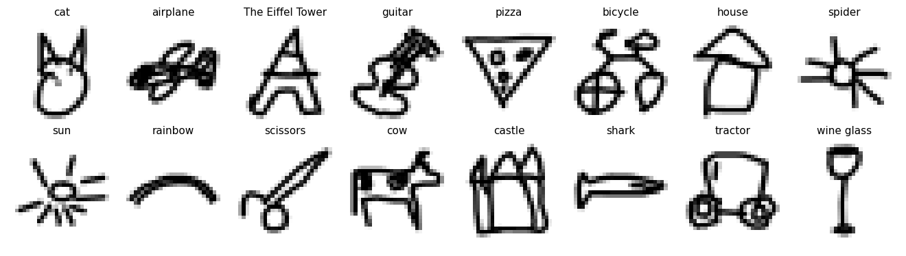
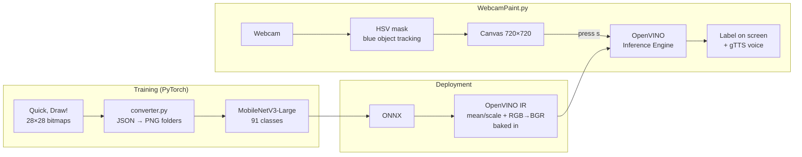

<div align="center">

# ✏️ QuickDraw: Air Drawing Recognition

**Draw in the air in front of your webcam, and a neural network guesses what you drew and says it out loud.**

*Intel Summer School 2021 project*

🏆 **1st place in the project competition of the Intel Summer School on Computer Vision**


</div>

---

## Awards

- 🥇 **1st place** in the project competition of the Intel Summer School on Computer Vision, held jointly with Lobachevsky University (UNN), July 5–23, 2021
- 🎓 **Certificate of participation**, Intel Summer School on Computer Vision, July 5–23, 2021

<table>
  <tr>
    <td align="center" width="50%">
      <a href="assets/certificates/Intel_competition_winner.pdf">
        
      </a>
      <br><sub><b>1st place</b>, project competition</sub>
    </td>
    <td align="center" width="50%">
      <a href="assets/certificates/Intel_Summer_School_participant.pdf">
        
      </a>
      <br><sub>Certificate of participation</sub>
    </td>
  </tr>
</table>

<sub>Click a certificate to open the original PDF.</sub>

## About

QuickDraw is a real-time sketch recognition demo inspired by Google's
[Quick, Draw!](https://quickdraw.withgoogle.com/) game. You don't need a mouse
or a tablet. Pick up any **blue object** (a marker cap, a bottle lid, a
sticker on your finger) and draw with it in front of the webcam:

1. **OpenCV** tracks the blue object and turns its path into strokes on a virtual canvas.
2. Press `s` and the canvas goes to a **MobileNetV3-Large** classifier trained on 91 Quick, Draw! categories.
3. Inference runs on CPU with **Intel OpenVINO™**. The model was converted PyTorch → ONNX → OpenVINO IR.
4. The predicted label is shown on screen and **read aloud** with Google Text-to-Speech.

On the validation set the model reaches **80.2% top-1** and **94.8% top-5** accuracy.

<div align="center">

<br><sub>Sample drawings from the validation set (28×28, shown inverted)</sub>
</div>

## Pipeline



## Model

| | |
|---|---|
| **Architecture** | MobileNetV3-Large ([Howard et al., 2019](https://arxiv.org/abs/1905.02244)), trained from scratch |
| **Input** | 1 × 3 × 224 × 224 |
| **Classes** | 91 ([`data_json/classes.txt`](data_json/classes.txt)) |
| **Training** | SGD (lr = 1e-3, momentum 0.9), StepLR (step 7, γ = 0.1), cross-entropy |
| **Augmentation** | Resize 224, random horizontal flip, ImageNet normalization |
| **Deployment** | ONNX → OpenVINO IR (FP32). Normalization and channel reversal are built into the IR, so the app feeds raw pixels |

### Results

Measured on the full validation split (27,300 images, 91 classes) with `pretrained/model.onnx`:

| Metric | Accuracy |
|---|---:|
| **Top-1** | **80.2%** |
| Top-5 | 94.8% |

For comparison, random guessing over 91 classes gives about 1.1% top-1.

## Dataset

A subset of the [Quick, Draw! dataset](https://github.com/googlecreativelab/quickdraw-dataset)
with **91 categories**, stored as 28×28 grayscale bitmaps:

| Split | Images | Per class |
|---|---:|---:|
| train | 63,700 | ~700 |
| val | 27,300 | ~300 |

Categories include *airplane, apple, bicycle, cat, guitar, pizza, rainbow,
The Eiffel Tower, wine glass*, and more. See the
[full list](data_json/classes.txt).

## Project structure

```
QuickDraw/
├── WebcamPaint.py          # real-time demo: webcam drawing + OpenVINO inference + voice
├── common/
│   ├── mobilenetv3.py      # MobileNetV3-Large / Small implementation
│   ├── mmodel.py           # transforms, dataloaders, save/load, batch prediction
│   └── pipeline.py         # training loop (train_mnetv3)
├── data_json/
│   ├── data_json.zip       # dataset as JSON (train/val images + labels + names.csv)
│   ├── converter.py        # JSON → data/{train,val}/<class>/*.png
│   └── classes.txt         # class names, in model output order
├── pretrained/             # PyTorch weights + ONNX export
│   ├── model.pth
│   ├── model_weights.pth
│   └── model.onnx
└── mo_model/               # OpenVINO IR used by the demo
    ├── model.xml
    ├── model.bin
    └── model.mapping
```

## Getting started

### 1. Install

```bash
git clone https://github.com/gertelrina/QuickDraw.git
cd QuickDraw

pip install -r requirements.txt
# the demo also needs:
pip install openvino==2021.4.2 gTTS pygame glog
```

> **Note:** the demo uses the legacy `openvino.inference_engine` API, so it
> needs **OpenVINO 2021.x**. Newer releases removed that API.

### 2. Run the demo

The trained model is already in `mo_model/`, so you can run the demo right away:

```bash
python WebcamPaint.py
```

Two windows open: **Tracking** (the camera feed) and **Paint** (the canvas the model sees).

| Key | Action |
|:---:|---|
| `s` | **Send** the drawing to the model. The prediction is shown and spoken, then the canvas is cleared |
| `h` | Lift / lower the "pen" to start a new stroke without a connecting line |
| `c` | Clear the canvas |
| `q` | Quit |

> **Tips:** use a bright, clearly blue object and good lighting. Draw big,
> simple shapes, as in the original game. The camera frame is cropped to
> 720×720, so a 720p or higher webcam works best.

### 3. Train your own model (optional)

```bash
# unpack the dataset and turn it into an ImageFolder layout
unzip data_json/data_json.zip -d data_json
python -c "from data_json.converter import convert; convert()"

# train MobileNetV3-Large; the best checkpoint goes to pretrained/best_model/
python -c "from common.pipeline import train_mnetv3; train_mnetv3(num_epochs=25)"
```

Then export to ONNX and convert to OpenVINO IR with the same preprocessing baked in:

```bash
mo --input_model pretrained/model.onnx --output_dir mo_model \
   --mean_values "[123.675,116.28,103.53]" \
   --scale_values "[58.395,57.12,57.375]" \
   --reverse_input_channels
```

## Acknowledgements

- [Quick, Draw!](https://quickdraw.withgoogle.com/) and the
  [Quick, Draw! dataset](https://github.com/googlecreativelab/quickdraw-dataset) by Google Creative Lab
- MobileNetV3 implementation adapted from
  [d-li14/mobilenetv3.pytorch](https://github.com/d-li14/mobilenetv3.pytorch)
- [Intel® Distribution of OpenVINO™ Toolkit](https://github.com/openvinotoolkit/openvino)
